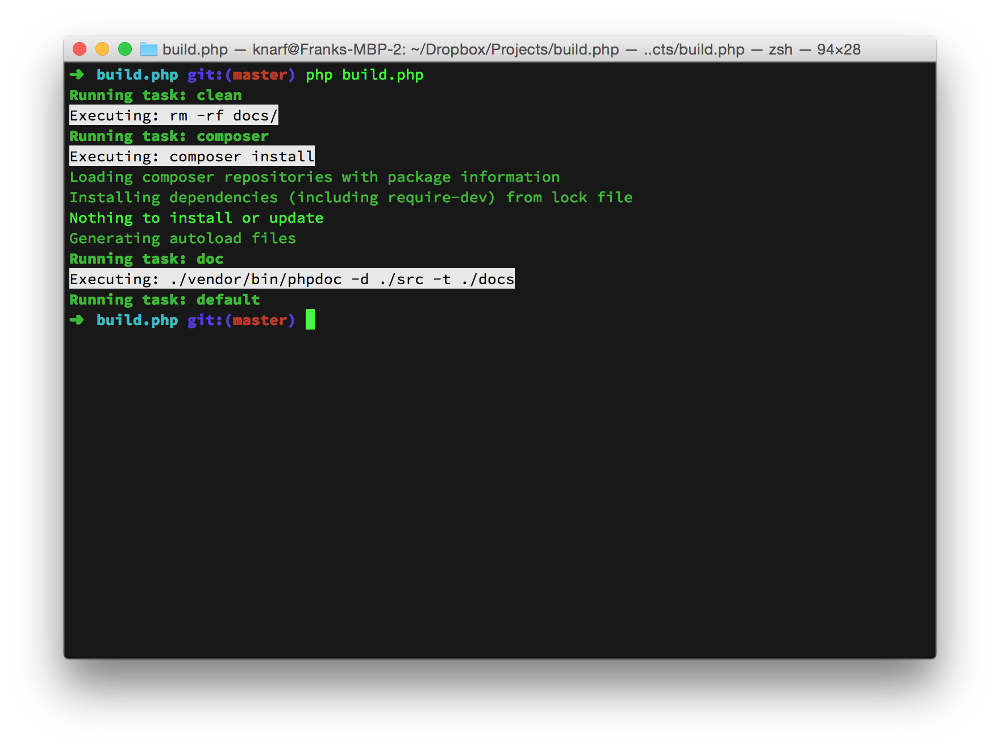

# Build.php

A simple build system for PHP



## Usage

Add to `composer.json` under `require-dev` to use.

```
{
    "require-dev": {
        "theknarf/build.php": "dev-master"
    }
}
```

Then you can create a build.php file and run `php build.php` to build.
If you don't specify a task to run the default task is `default`.
To specify a task run `php build.php taskname`.

### Example build.php file

```
<?php
require 'vendor/autoload.php';

$build = new TheKnarf\Buildphp\Build();
$build->task("default", array("composer"), function() {});
$build->task('composer', function() {
	$this->exec("composer install");
});
$build();
```

## Copyright

Copyright (c) 2015 - Frank Lyder Bredland

This software is provided 'as-is', without any express or implied
warranty. In no event will the authors be held liable for any damages
arising from the use of this software.

Permission is granted to anyone to use this software for any purpose,
including commercial applications, and to alter it and redistribute it
freely, subject to the following restrictions:

1. The origin of this software must not be misrepresented; you must not
   claim that you wrote the original software. If you use this software
   in a product, an acknowledgement in the product documentation would be
   appreciated but is not required.
2. Altered source versions must be plainly marked as such, and must not be
   misrepresented as being the original software.
3. This notice may not be removed or altered from any source distribution.